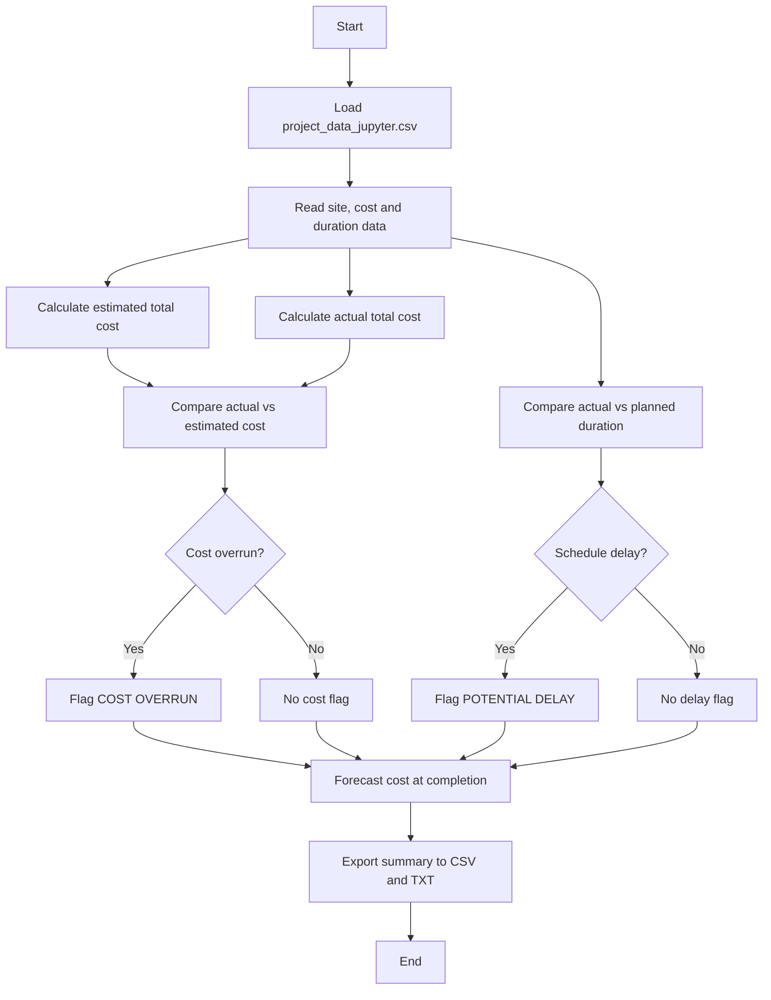

 Project Cost Analysis Tool
This Python tool is designed to support construction project cost monitoring in a structural engineering context. 
1.It reads structured project data from a .csv file and performs the following operations:
2.Loads site-level project data including estimated and actual material costs, labour costs, and construction durations
3.Calculates the total cost per site as the sum of material and labour costs (estimated and actual separately)
4.Compares actual expenditure and duration against the original budget and programme, computing cost variance and schedule variance for each site
5.Highlights sites where the budget has been exceeded (cost overrun) or the construction timeline has been exceeded (potential delay), applying a RAG-style status flag: COST OVERRUN, POTENTIAL DELAY, or ON TRACK
6.Forecasts the estimated cost at completion using a daily burn-rate model based on Earned Value Management (EVM) principles — if a delay trend continues, the tool projects the additional cost that will be incurred
7.Exports a structured summary report to both .csv and .txt formats for submission or further analysis

The tool is built using only Python standard libraries (csv, pathlib) with no external dependencies, making it fully portable and compatible with Google Colab and JupyterLite environments.

 ## Workflow

    
