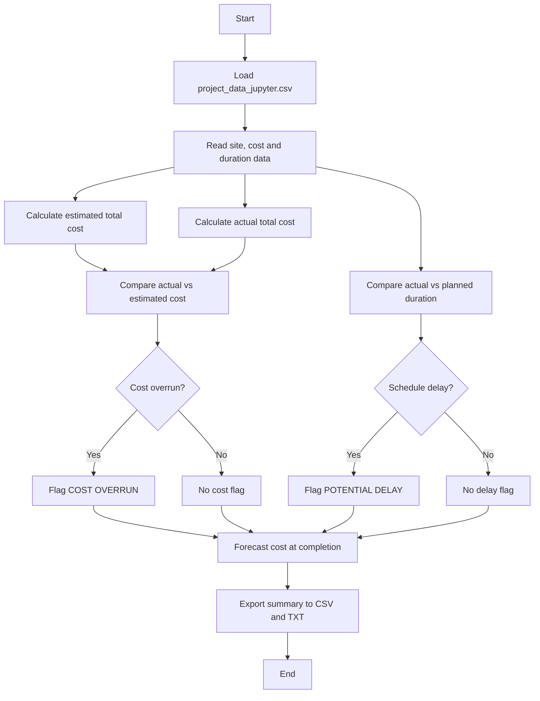

 Project Cost Analysis Tool
A Python tool for construction project cost monitoring in a structural engineering context.

What It Does
Loads site-level project data from a .csv file

Calculates total cost per site (materials + labour)

Compares actual vs. estimated cost and duration

Flags sites with cost overruns or schedule delays

Forecasts cost at completion if delay trends continue

Exports results to .csv and .txt summary reports

 ## Workflow

    
